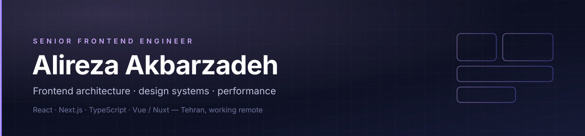

  

  
  
  
  

---

Senior Frontend Engineer in Tehran. Six years in production web platforms — the
last four owning frontend architecture for [Tapsi Shop](https://tapsi.shop), a
high-traffic e-commerce platform.

I work at the level of structure rather than screens: **module boundaries, state
ownership, rendering strategy**, and the standards that keep a growing codebase
fast to change. Most of what I care about shows up six months later — whether a
new feature takes a day or a week, whether the design system holds or drifts,
whether p75 LCP survives the next release.

## What that looks like in practice

| | |
|---|---|
| **Architecture** | A Feature-Sliced Design module structure across a storefront, an admin panel and a vendor panel, with explicit boundaries for state ownership and data flow — three teams working in parallel without stepping on each other. |
| **Performance** | ~30% better Core Web Vitals and load performance from a deliberate SSR/SSG and caching strategy, React Profiler work, bundle analysis and image optimization. |
| **Design systems** | A Storybook-documented design system on design tokens, shared across three products — ~20% faster feature delivery, and UI drift between panels stopped. |
| **Standards** | Typed API contracts, lint and CI gates, error boundaries, production error monitoring, structured code review. Production bugs down ~20%. |

## Selected work

<table>
<tr>
<td width="50%" valign="top">

### [NovaStudio](https://github.com/alireza-akbarzadeh/NovaStudio)

An AI-native collaborative IDE in the browser. A Monaco workspace running real
Node via **WebContainers**, a full git loop with GitHub clone and publish, live
multiplayer editing (Liveblocks + Yjs), and AI chat grounded in the open files
and project tree.

`Next.js 16` `React 19` `TypeScript` `Convex` `Vercel AI SDK`

</td>
<td width="50%" valign="top">

### [Stramify](https://github.com/alireza-akbarzadeh/stramify-vue) · [live](https://stramify.vercel.app)

A Twitch/YouTube-style streaming platform built architecture-first: session auth
with RBAC, WebSocket chat, a custom player, ranked feeds. Every decision is
written down as an
[ADR](https://github.com/alireza-akbarzadeh/stramify-vue/blob/master/docs/DECISIONS.md)
— including the rejected alternatives.

`Nuxt 4` `Vue 3` `Postgres` `Drizzle` `WebSockets`

</td>
</tr>
<tr>
<td width="50%" valign="top">

### [react-launchpad](https://github.com/alireza-akbarzadeh/react-launchpad)

An opinionated React starter kit — the defaults I reach for on a new project,
with the reasoning for each one written down.

`React` `TypeScript` `Vite`

</td>
<td width="50%" valign="top">

### [frontend-handbook](https://github.com/alireza-akbarzadeh/frontend-handbook)

A guide to modern frontend development — what I'd want a mid-level engineer on
my team to have read.

`MDX` `Mintlify`

</td>
</tr>
</table>

## Stack

**Daily** — TypeScript · React · Next.js (App Router, RSC, streaming, caching) ·
TanStack Query · Tailwind · shadcn/ui · Zod · Vitest / Playwright

**Also work in** — Vue 3 / Nuxt · React Native · Node · Postgres + Drizzle ·
Nx / Turborepo · Docker · GitHub Actions

**AI** — Claude and LLM APIs in daily development and shipped in product features

## Currently

Building **NovaStudio**, and writing up what I learned running a design system
across three products.

GitHub activity

 

---

  Open to senior frontend roles, remote · <a href="mailto:work.alireza.akbarzadeh@gmail.com">work.alireza.akbarzadeh@gmail.com</a>

